```{r SETUP, include=FALSE}
library(tidyverse)
knitr::opts_chunk$set(message = FALSE)
knitr::opts_chunk$set(echo = FALSE)
```

class: middle

.pull-left[
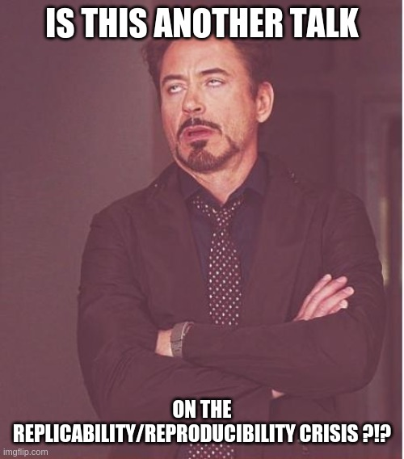
]
--
.pull-right[
## Si, ma: 

- Proverò a darvi un'idea su quei problemi che non sono facilmente identificabili se non si è "esperti"

- Cercherò di darvi la mia prospettiva sul perchè non dovreste **mai fidarvi** di un elettrofisiologo

- Proverò a condividere con voi un paio di possibili soluzioni
]

---

class: center, middle

# Let's start then!

---
# Un pò di storia

- 2009: Neural correlates of interspecies perspective taking in the post-mortem Atlantic Salmon:
An argument for multiple comparisons correction (Bennett et al., OHBM)

- 2016: Cluster failure: Why fMRI inferences for spatial extent
have inflated false-positive rates (Eklund et al., PNAS)

- 2020: Variability in the analysis of a single neuroimaging dataset by many teams (Botvinik-Nezer et al., Nature)

--
.center[
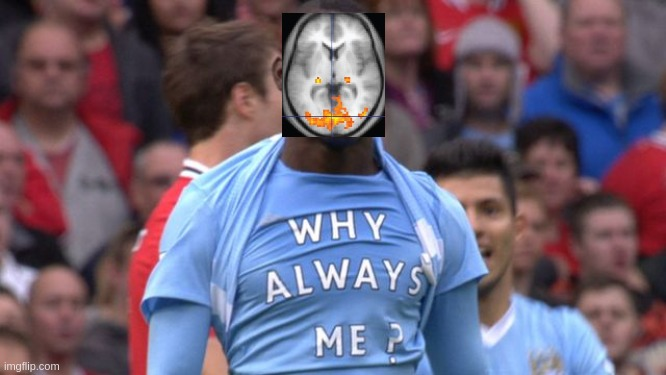
]
---

La (quasi) totalità del dibattito intorno ai problemi metodologici/statistici nelle neuroscienze sta riguardando l'**fMRI**.  

  
--
I motivi sono tanti (e a me non del tutto chiari):

- Elevata visibilità delle ricerche fMRI --> potenziale impatto?
- Elevato costo --> evitare lo spreco di fondi?
- Relativa standardizzazione della tecnica (l'unità di analisi è una sequenza di immagini di dimensioni standard tra studi)  


--
Al tempo stesso un terzo delle ricerche nelle neuroscienze cognitive usano tecniche elettrofisiologiche

```{r TEC, echo=FALSE, out.width="45%",out.height="45%",fig.align='center'}
data = data.frame(tec = factor(c("fMRI", "EEG/MEG"), levels = c("fMRI", "EEG/MEG")),
                  val = c(33558,18886)
)

ggplot(data, aes(data, x = tec, y = val, fill = tec)) +
  geom_col(position="stack") +
  labs(x = NULL, y = NULL, title = "# Published papers 2010-2020") +
  theme_minimal() +
  theme(legend.title = element_blank(),
        axis.text.x = element_blank(),
        panel.grid = element_blank(),
        axis.line.y = element_line(colour = "black",
                                 arrow = grid::arrow(length = unit(0.3, "cm"), ends = "last")
                                 ),
        legend.text = element_text(size = 20)
        ) +
  scale_y_continuous(expand = c(0,0))

```


---
# EEG in a nutshell

.middle[
.pull-left[
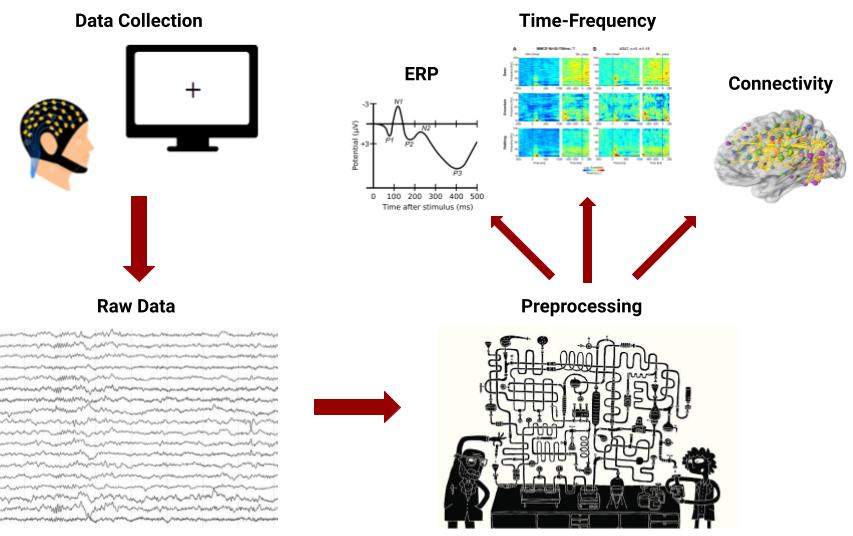]
]

.pull-right[
Le dimensioni di indagine sono:

- Spazio
- Tempo
- Frequenza  
]

.center[
###Ciò che rende questa tecnica estremamente flessibile è anche il motivo per cui è molto difficile sviluppare _pipelines_ di analisi standardizzate
]


---
# Preprocessing: Where the magic happens
L'elemento più delicato di un qualsiasi studio EEG/ERP/MEG è il preprocessing, ovvero quella sequenza di operazioni che consentono di passare dal tracciato _grezzo_ al dato di interesse che verrà utilizzato per la statistica

.center[
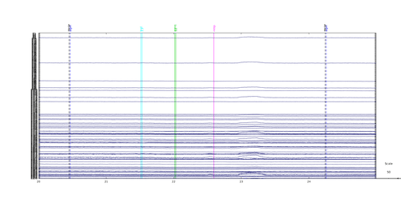]

--
.left[
In generale, il preprocessing consiste _almeno_ nelle seguenti operazioni:

- Filtering
- Segmentazione del tracciato continuo in epoche di interesse
- <span style="background-color: yellow;"> Detezione e rimozione/correzione di artefatti</span>
]
.center[
Di quanti tipi di artefatti dobbiamo preoccuparci?
]

---
# Fantastic artifacts and where to find them

Gli artefatti più comuni che caratterizzano un tracciato elettroencefalografico sono:
.pull-left[
- Movimenti oculari (blinks e saccadi)
- Tensione muscolare (> 20 Hz)
- Artefatto di rete (50 Hz)
]
.pull-right[
- Potenziali evocati <span style="font-size: 30px"> &#9760; </span>
- Analisi in (tempo-)frequenza <span style="font-size: 30px"> &#9760; </span>
]

--
.center[### How to deal with them?]
- Approcci multivariati (i.e. PCA, ICA) per identificare componenti **stabili** e **stereotipiche**
- Criteri basati sull'ampiezza del segnale (i.e. se - _soglia_ mV < A < _soglia_ mV scarta l'epoca)
- **Ispezione visiva**

---
# Fantastic artifacts and where to find them

.center[
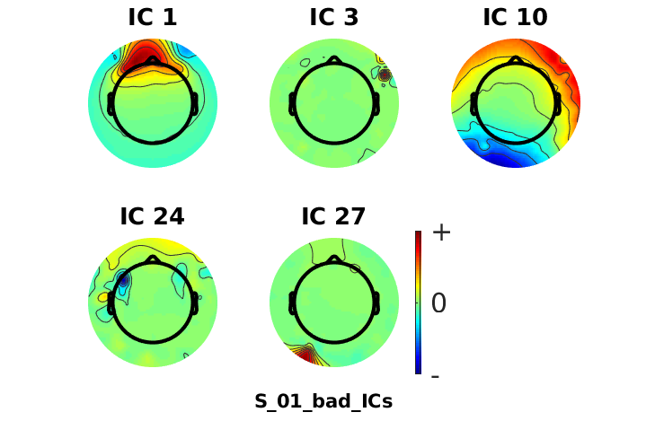]

---
# The _hidden_ variability
Sebbene gli strumenti per gestire e contenere gli artefatti in un tracciato EEG esistano, vengono utilizzati lasciando **un'ampia discrezionalità al _data analyst_**

- Quali componenti ICA sono da rimuovere e quali sono da conservare?
- Quale soglia mi consente di identificare tutte le epoche contaminate?

Nella stragrande maggioranza dei casi queste scelte sono *arbitrarie* e frutto della consuetudine/esperienza  


--
La logica dietro le scelte compiute durante il preprocessing non solo non viene giustificata, ma nemmeno riportata negli articoli

.center[
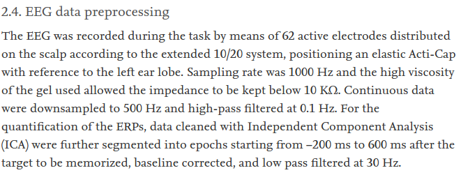]

---
# STANDARDIZE, STANDARDIZE, STANDARDIZE!
Sulla scia di quanto accaduto nel mondo del neuroimaging, negli ultimi anni c'è una crescente spinta a sviluppare _pipeline_ analitiche:

- Standardizzate
- Riproducibili
- <span style="background-color: yellow;">Scalabili</span>
- <span style="background-color: yellow;">Armonizzate</span>  


--
Con la maggiore accessibilità di sistemi ad alta densità (>100 canali) e la spinta a raccogliere dataset di grandi dimensioni (n > 100), un approccio dipendente da scelte soggettive è **semplicemente impossibile da applicare**

--
### Alcuni esempi
- [PREP pipeline](https://doi.org/10.3389/fninf.2015.00016)
- [ICLabel](https://doi.org/10.1016/j.neuroimage.2019.05.026)
- [Automagic](https://doi.org/10.1016/j.neuroimage.2019.06.046)

---
# STANDARDIZE, STANDARDIZE, STANDARDIZE!

.pull-left[
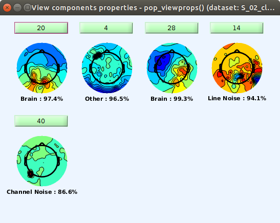
]

.pull-right[
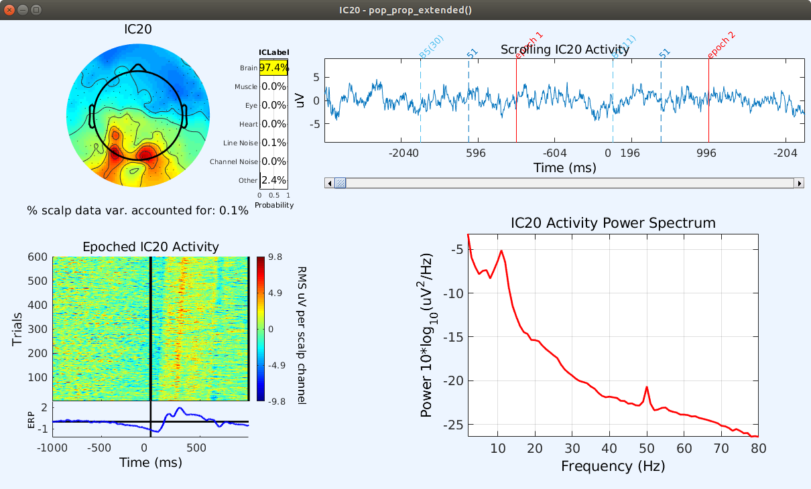
]

---
class: center, middle

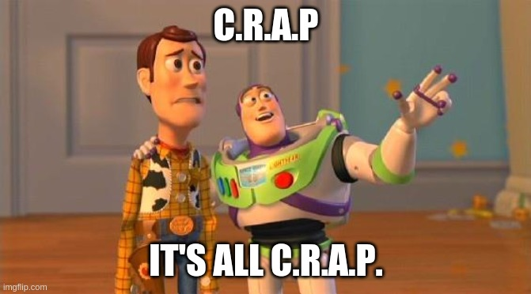

.footnote[
C.R.A.P. = Commonly Recorded Artifactual Potentials (quoted from Steven Luck)
]
---
# Stats: the less _hidden_ variability

.left-square[
Selezione degli elettrodi
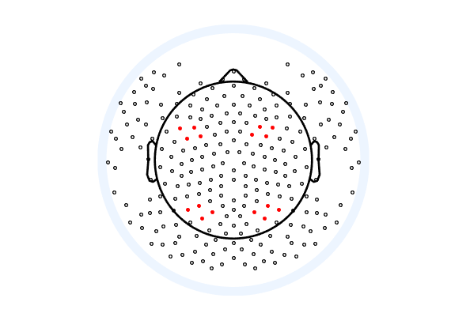
]

.right-square[
Selezione delle finestre temporali
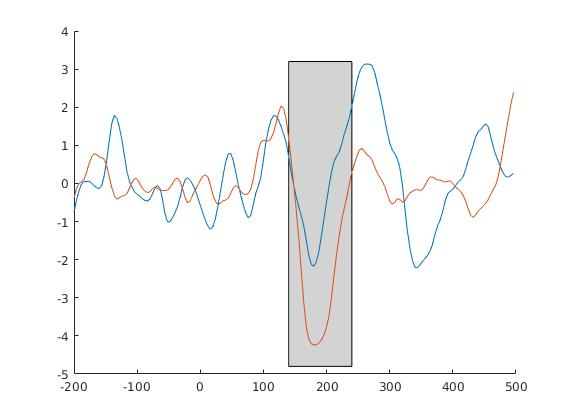
]

.left-square[
Flessibilità nella scelta di cosa analizzare  
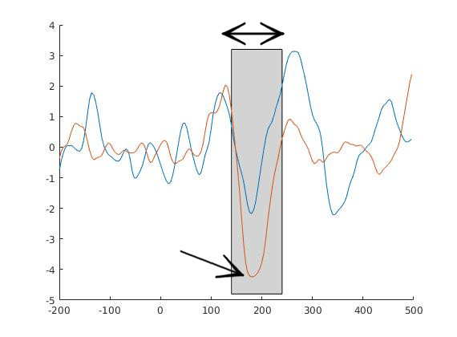
]

.right-square[
Utilizzo di complicati disegni fattoriali*  

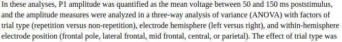

<span style="font-size: 50%">[*Luck, S.J. & Gaspelin, N. (2017). How to Get Statistically Significant Effects in Any ERP Experiment (and Why You Shouldn’t)](https://dx.doi.org/10.1111%2Fpsyp.12639)</span>
]

---
## Stats: a better non-parametrical approach
.center[
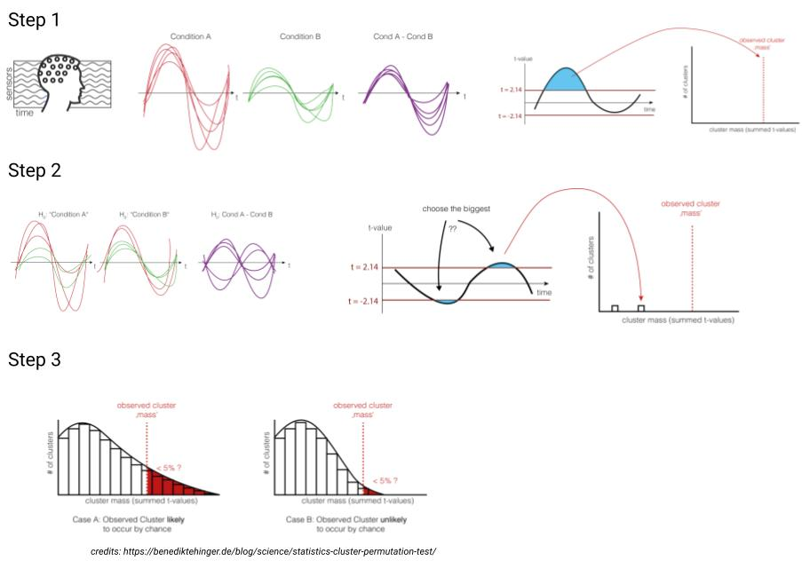
]

---
## Stats: a better non-parametrical approach

Un approccio di tipo _mass-univariate_ non parametrico è da preferire, perchè:

- Meno dipendente da scelte soggettive
- Non poggia su assunzioni (quasi) mai rispettate
- Penalizza effetti piccoli e isolati
- Magnifica effetti distribuiti e robusti

--
.center[
### Eh ma il mio è un disegno fattoriale, come faccio?  
]

--
.center[
Questo tipo di approccio è estendibile a qualsiasi statistica test si scelga e ai disegni fattoriali 3x3x3x3x3x3x3x3x3x3....

[Factorial Mass Univariate Toolbox](https://github.com/ericcfields/FMUT)
]
---
## How to fix the situation? Can it be fixed at all?

Allo stato attuale, la gigantesca variabilità nelle procedure di analisi di dati elettrofisiologici, rende il panorama dei risultati pubblicati quantomeno dubbio

.pull-left[


Ha come scopo provare a replicare 27 "classici" della letteratura EEG/ERP  
Ogni studio proverà ad essere replicato in almeno 3 gruppi di ricerca indipendente  

Status: Iniziato nel 2020
]

.pull-right[
###\#EEGManyPipelines

Ha come scopo di quantificare la variabilità nelle procedure di analisi tra gruppi di ricerca diversi e studiarne l'impatto sul risultato finale  

Status: In fase di preparazione e reclutamento dei team di analisi
]

---
## How to fix the situation? Can it be fixed at all?

Ridefinire il modo con cui queste tecniche vengono studiate ed insegnate

Fondamenti di algebra lineare e signal processing sono **essenziali** non solo per *usare* queste tecniche ma anche semplicemente per *capire* i lavori che se ne servono e giudicarne la qualità ed il valore


.center[
###Non è solo un titolo _fancy_ per un articolo!!!

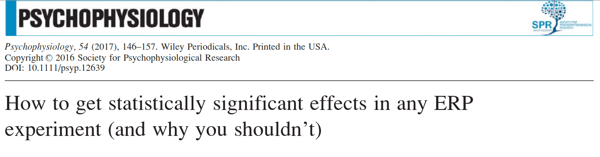
]

---

class: center, middle

# Thanks!
###(and never trust an electrophysiologist)

